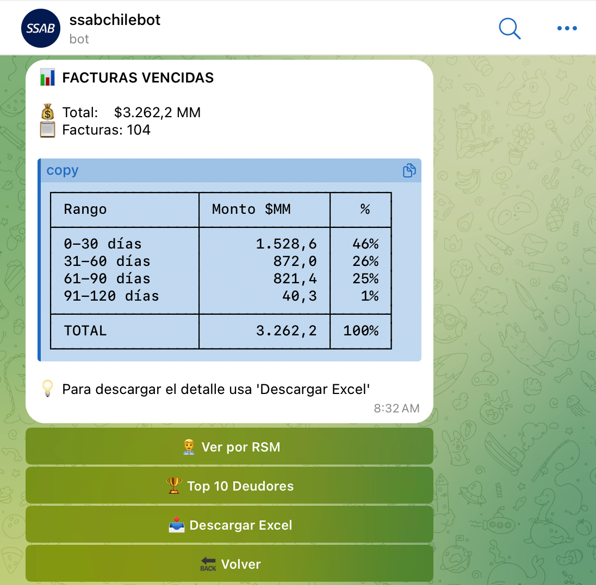

# 📱 Manual de Usuario - Bot SSAB Chile

> **Bot de Gestión Comercial SSAB Chile**  
> Versión 2.0 - Noviembre 2025

[](https://github.com/laguileracl/manual-bot-ssab)
[](LICENSE)
[](docs/)

## 📋 Descripción

Manual de usuario completo para el Bot de Gestión Comercial SSAB Chile. Este bot permite al equipo comercial acceder instantáneamente a información crítica del negocio desde Telegram.

## 🎯 Características Principales

- ⚡ **Acceso Instantáneo**: Información disponible 24/7 desde cualquier dispositivo
- 📊 **Reportes Profesionales**: Generación automática de Excel con datos actualizados
- 🎯 **Búsqueda Inteligente**: Encuentra clientes y productos rápidamente
- 📈 **Análisis de Cartera**: Visualización completa del estado de cuentas por cobrar
- 🔒 **Seguridad**: Acceso controlado solo para usuarios autorizados

## 📖 Documentación

### Formatos Disponibles

- **[🌐 Manual HTML](Manual_Usuario_SSAB_Final.html)** - Versión web interactiva (descárgala y ábrela en tu navegador)
- **[📊 Presentación PowerPoint](Manual_Usuario_Bot_SSAB_Final.pptx)** - Para capacitaciones
- **[📝 Markdown](GUIA_USUARIO.md)** - Manual completo en formato Markdown

### Manual Completo

Lee el [**Manual Completo aquí**](GUIA_USUARIO.md) que incluye:

- 🎯 Introducción y Beneficios
- 🔑 Requisitos Previos  
- 🚀 Inicio y Acceso
- 👥 Gestión de Clientes
- 📋 Fichas Técnicas
- 💰 Cuentas por Cobrar
- 💼 Casos de Uso Prácticos
- ❓ Preguntas Frecuentes

## 🚀 Inicio Rápido

### Paso 1: Buscar el Bot

1. Abrir Telegram
2. Buscar: `@oxcl_bot`
3. Presionar "Iniciar"

### Paso 2: Verificar Acceso

Si no tienes acceso autorizado, contacta al administrador:

- 👤 **Luis Aguilera**
- 📧 luis.aguilera@ssab.com
- 📞 [WhatsApp](https://wa.me/56973881390)

## 📸 Capturas de Pantalla

<table>
  <tr>
    <td align="center">
      <br/>
      <sub><b>Buscar Bot</b></sub>
    </td>
    <td align="center">
      <br/>
      <sub><b>Inicio</b></sub>
    </td>
    <td align="center">
      <br/>
      <sub><b>Menú Principal</b></sub>
    </td>
  </tr>
  <tr>
    <td align="center">
      <br/>
      <sub><b>Ficha Cliente</b></sub>
    </td>
    <td align="center">
      <br/>
      <sub><b>Catálogo</b></sub>
    </td>
    <td align="center">
      <br/>
      <sub><b>Facturas Vencidas</b></sub>
    </td>
  </tr>
</table>

## 💼 Casos de Uso

### ⚡ Consulta Rápida en Terreno (15 segundos)

```
Bot → Clientes → Buscar → Ver línea de crédito
```

### 📊 Reporte de Morosidad (30 segundos)

```
Bot → Cuentas x Cobrar → Vencidas → Excel con 5 hojas
```

### 📋 Envío de Ficha Técnica (20 segundos)

```
Bot → Fichas Técnicas → Buscar → Descargar PDF → Compartir
```

## 🎮 Funcionalidades

### 👥 Gestión de Clientes

- Búsqueda por nombre o código SAP
- Información completa del cliente
- Línea de crédito y disponibilidad
- Exportar contacto como vCard
- Descargar reporte en Excel

### 📋 Fichas Técnicas

- Catálogo de productos (Labios, Mainframe Liner, Ripper)
- Búsqueda por código o palabra clave
- Ficha técnica completa en PDF
- Especificaciones, precios y stock
- Tiempos de entrega

### 💰 Cuentas por Cobrar

- Facturas vencidas por rangos
- Facturas por vencer (próximos 30 días)
- Estado de cuenta por cliente
- Top clientes morosos
- Estado general de cartera
- Vista por RSM (ejecutivo de ventas)
- Reportes Excel con 5 hojas

## ❓ Preguntas Frecuentes

**¿Cómo obtengo acceso al bot?**
> Contacta al administrador con tu usuario de Telegram (@usuario)

**¿Qué tan actualizados están los datos?**
> Los datos se actualizan diariamente desde SAP

**¿Los precios incluyen IVA?**
> No, todos los precios son netos (sin IVA)

**¿En qué formato se descargan los reportes?**
> Excel (.xlsx) para datos, PDF para fichas técnicas, vCard (.vcf) para contactos

[Ver el manual completo para más información →](GUIA_USUARIO.md)

## 📞 Soporte

### Administrador del Sistema / Soporte Técnico

- 👤 **Nombre**: Luis Aguilera
- 📧 **Email**: luis.aguilera@ssab.com
- 📞 **WhatsApp**: https://wa.me/56973881390
- 🕐 **Horario**: Lunes a Viernes 09:00-18:00

## 📄 Historial de Versiones

| Versión | Fecha | Cambios |
|---------|-------|---------|
| 2.0 | Nov 2025 | • Estado General Cartera<br>• Vista por RSM<br>• Excel con 5 hojas |
| 1.5 | Oct 2025 | • Top Clientes Morosos<br>• Mejoras UI |
| 1.0 | Sep 2025 | • Lanzamiento inicial<br>• Funciones básicas |

## 🤝 Contribuir

Este manual es de código abierto. Si encuentras errores o tienes sugerencias:

1. Abre un [Issue](https://github.com/laguileracl/manual-bot-ssab/issues)
2. Envía un [Pull Request](https://github.com/laguileracl/manual-bot-ssab/pulls)
3. Contacta al administrador

## 📜 Licencia

Este proyecto está bajo la Licencia MIT - ver el archivo [LICENSE](LICENSE) para detalles.

## 🔗 Enlaces

- [Bot en Telegram](https://t.me/oxcl_bot) - @oxcl_bot
- [Sitio Web SSAB](https://www.ssab.com/es-cl)

---

<div align="center">

**Bot de Gestión Comercial SSAB Chile**  
*Desarrollado con ❤️ para el equipo comercial*

📧 [luis.aguilera@ssab.com](mailto:luis.aguilera@ssab.com) | 📱 [WhatsApp](https://wa.me/56973881390)

</div>
